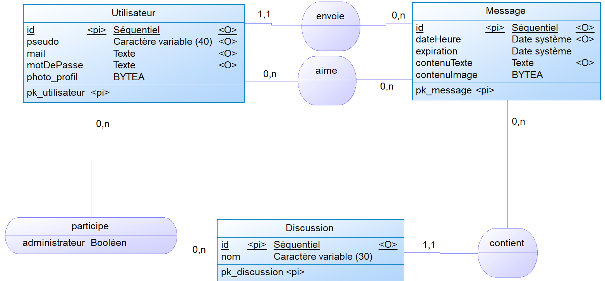

# Campustalk : un fil de discussion fait par des étudiants pour les étudiants

**Campustalk** est une application de messagerie qui permet aux utilisateurs d’envoyer des messages textes ou des images dans des fils de discussion. Chaque message peut avoir une durée de vie personnalisée, définie par l’utilisateur lors de l’envoi, ou être permanent.

Les utilisateurs peuvent créer des fils de discussion en y invitant les personnes de leur choix, ainsi que quitter ceux auxquels ils participent. Le créateur d’un fil de discussion en devient automatiquement l’administrateur, lui donnant la possibilité d’ajouter de nouveaux membres à la discussion.

Lors de l’inscription, chaque utilisateur renseigne une adresse e-mail, un mot de passe, un pseudo, ainsi qu’une photo de profil facultative (une image noire est attribuée par défaut en l’absence de photo). Les pseudos et adresses e-mail doivent être uniques. Par la suite, l’utilisateur peut à tout moment modifier ses informations personnelles ou se déconnecter.

L’application est développée en **JavaEE** et déployée sur **Tomcat**. Elle est accessible via un navigateur grâce à une interface front-end conçue avec **Bootstrap**, et propose également un service d’**API REST**.

## MCD et MLD réalisés

La base de cette application repose sur un système d'informations relationnel. Nous avons donc, dans un premier temps, réalisé le **modèle conceptuel de données** (**MCD**) suivant : 



À partir de ce MCD, nous avons pu en déduire le **modèle logique de données** (**MLD**) suivant :

**utilisateur**(<u>id</u>, pseudo, mail, motdepasse, photo_profil)\
**discussion**(<u>id</u>, nom)\
**message**(<u>id</u>, dateHeure, expiration, contenuTexte, contenuImage, #idUtilisateur, #idDiscussion)\
**participe**(<u>#idutilisateur, #iddiscussion</u>, administrateur)\
**aime**(<u>#idutilisateur, #idimage</u>)

Nous avons ensuite rédigé un script de création de la table idempotent conforme à ce MLD : [scriptCreation.sql](./scripts/scriptCreation.sql). Ce script contient également la création de deux vues **messageSansImage** et **utilisateurSansImage** permettant de consulter facilement ces tables, à des fins de déboguage, qui facilitent la consultation de ces tables à des fins de débogage, sans être gêné par l’affichage des données binaires des images enregistrées. Ce script est fait pour un usage avec **Postgresql**.

## Quelques requêtes pertinentes

### Requêtes d'ajout des données

Afin de pouvoir illustrer quelques cas d'usage de notre application, nous avons rédigé un script d'ajout de données : [scriptAjout.sql](./scripts/scriptAjout.sql). Nous détaillons ici quelques requêtes du script pour chacune des tables : 

```sql
INSERT INTO Utilisateur (pseudo, mail, motDePasse) VALUES
    ('Jonathan David', 'jonathan.david@losc.fr', MD5('password123')),
    ('Rémy Cabella', 'remy.cabella@losc.fr', MD5('securepass'));
```

Cette requête permet d'ajouter deux utilisateurs avec pour chacun un pseudo, une adresse mail et un mot de passe haché à l'aide de la fonction d'hachage MD5. Dans la base de données, les mots de passe ne seront jamais stocké "en dur" mais bien hachés (bien que cette fonction de hachage ne soit pas la meilleure).

---

```sql
INSERT INTO Discussion (nom) VALUES ('Groupe 1')
INSERT INTO Discussion DEFAULT VALUES;
```

Ces deux requêtes permettent chacune de créer une discussion. Pour la première, on donne uniquement le nom de la discussion, l'identifiant de discussion étant généré automatiquement. 

La deuxième requête, elle, permet de créer une discussion sans nom. L'identifiant de discussion étant un numéro automatique, nous ne donnons aucune valeur à la requête en utilisant la syntaxe `DEFAULT VALUES`.

---

```sql
INSERT INTO Participe (idUtilisateur, idDiscussion, administrateur) VALUES
    (1, 1, TRUE),
    (2, 1, FALSE),
    (3, 1, FALSE);
```

Cette requête permet d'ajouter à la discussion d'identifiant 1 trois utilisateurs (d'identifiants 1, 2 et 3).

---

```sql
INSERT INTO Message (dateHeure, contenuTexte, idUtilisateur, idDiscussion) VALUES
    ('2025-02-10 10:15:00', 'Salut les gars, prêt pour le match de ce week-end ?', 2, 1);
```

Cette requête permet l'insertion d'un message envoyé le 10 février 2025, par l'utilisateur d'identifiant 2, dans la discussion d'identifiant 1 et d'un contenu uniquement textuel.

---

```sql
INSERT INTO Aime (idUtilisateur, idMessage) VALUES
    (2, 1);
```

Cette requête permet d'un like de l'utilisateur d'identifiant 2 sur le message d'identifiant 1.

### Requêtes de manipulation des données

Enfin, nous avons rédigé un petit script de manipulation des données, [scriptManipulation.sql](./scripts/scriptManipulation.sql), contenant quelques requêtes utiles au développement de l'application. Dans ce script sont détaillés les significations de chacune des requêtes.